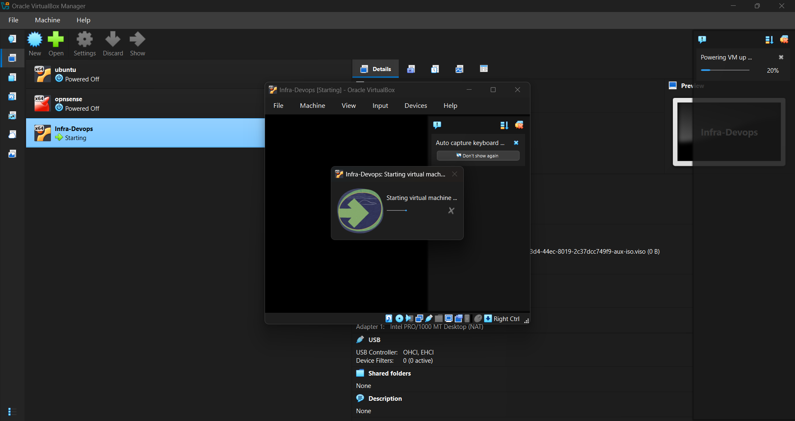
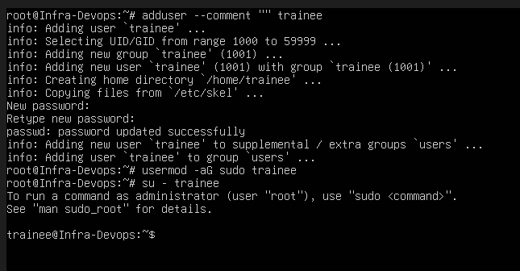
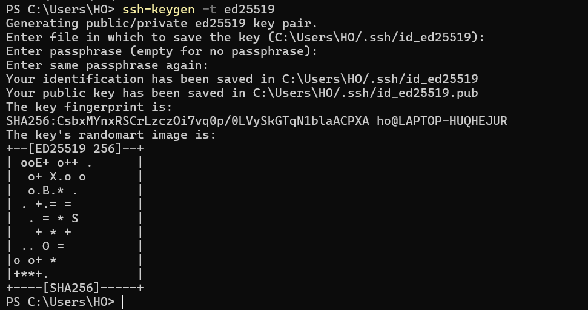
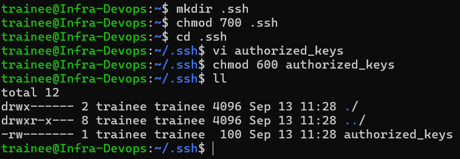
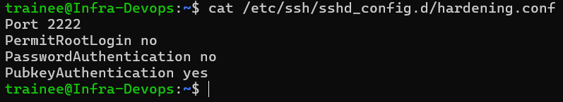
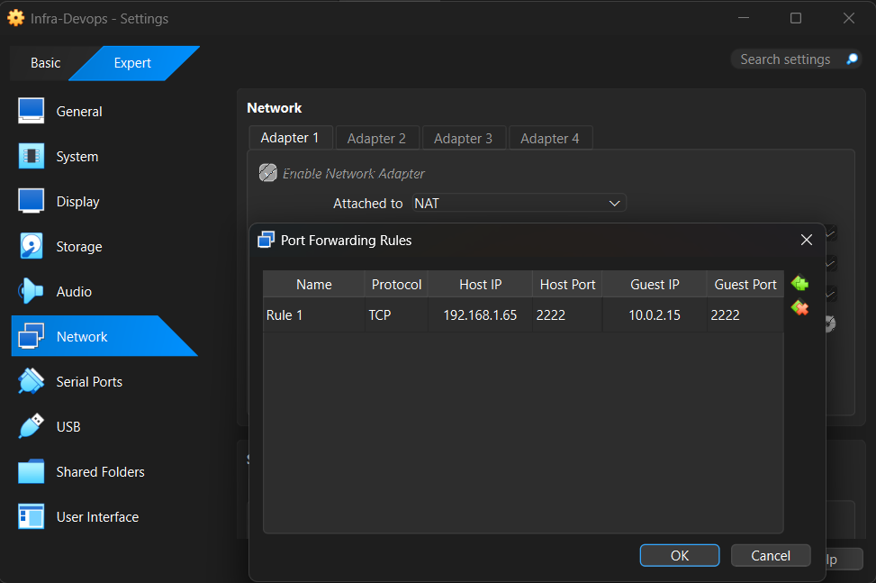
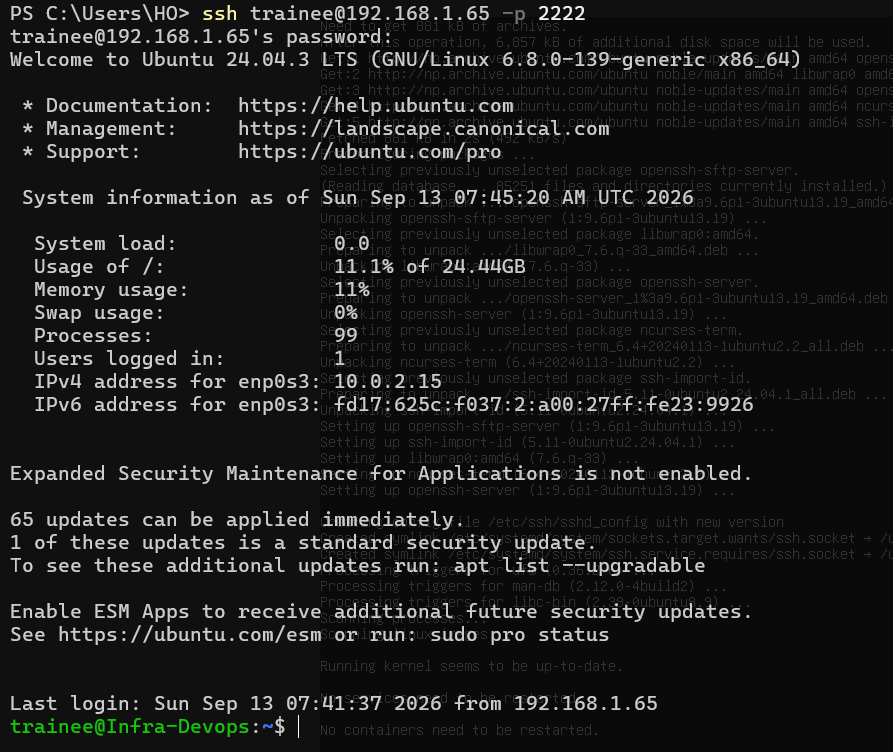
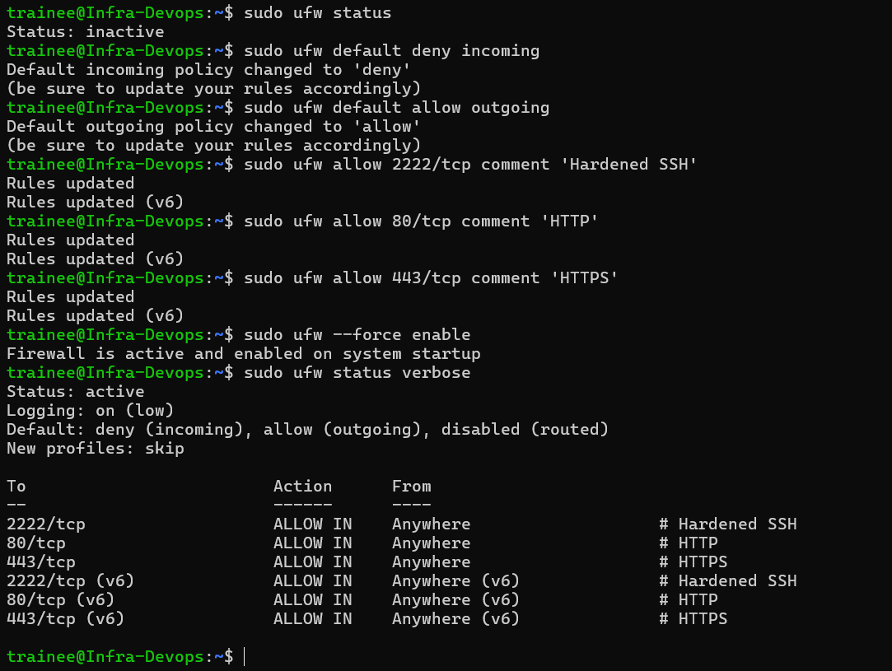

# infra-devops-assignment
Assignment for Techkraft

## Setup Instructions

### 1. Setup Ubuntu Environment

<figure>
  
  <figcaption>Figure 1: Ubuntu Setup in Oracle VirtualBox.</figcaption>
</figure>

<br>

### 2. Create trainee User

<figure>
  
  <figcaption>Figure 2: Add trainee User with sudo Privilege.</figcaption>
</figure>

<br>
<br>

* Add trainee user skipping the comments and add to sudo group
```bash
adduser --comment "" trainee
usermod -aG sudo trainee
su - trainee
```

### 2. Setup and Harden Key Based SSH Authentication

<figure>
  
  <figcaption>Figure 3: Generate the Key.</figcaption>
</figure>

<br>
<br>

```bash
ssh-keygen -t ed25519
```

<br>

<figure>
  
  <figcaption>Figure 4: Setup the Key.</figcaption>
</figure>

<br>
<br>

* Setup the key based ssh authentication in remote server
```bash
mkdir .ssh
chmod 700 .ssh
cd .ssh
vi authorized_keys
chmod 600 authorized_keys
```

<br>

<figure>
  
  <figcaption>Figure 5: Harden SSH Daemon.</figcaption>
</figure>

<br>
<br>

* Restart the ssh server
```bash
sudo systemctl restart ssh
```

<br>

<figure>
  
  <figcaption>Figure 6: Portforward in VirtualBox.</figcaption>
</figure>

<br>
<br>

<figure>
  
  <figcaption>Figure 7: Key Based Authentication with Hardened SSHD.</figcaption>
</figure>

<br>

### 2. Enable and Configure UFW

<figure>
  
  <figcaption>Figure 8: UFW Configuration.</figcaption>
</figure>

<br>
<br>

* UFW configuration for ssh, http and https
```bash
sudo ufw default deny incoming
sudo ufw default allow outgoing
sudo ufw allow 2222/tcp comment 'Hardened SSH'
sudo ufw allow 80/tcp comment 'HTTP'
sudo ufw allow 443/tcp comment 'HTTPS'
sudo ufw --force enable
```
