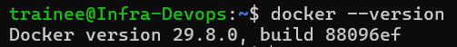
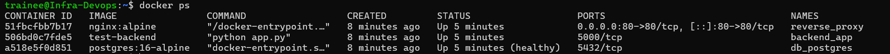
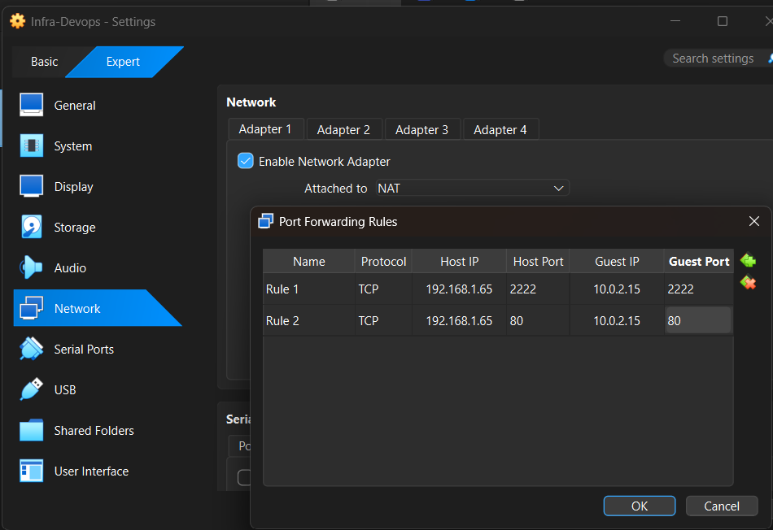
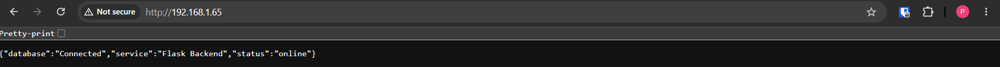
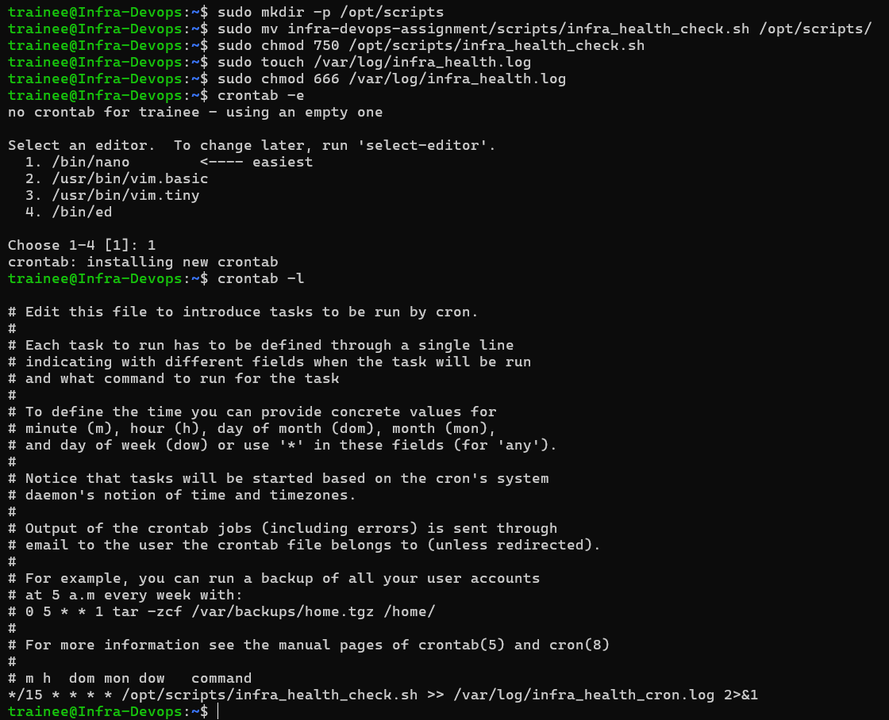
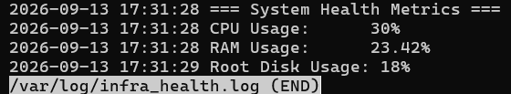
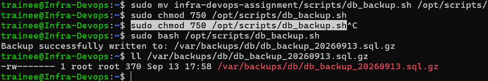
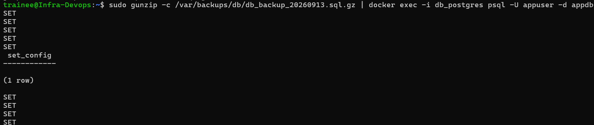
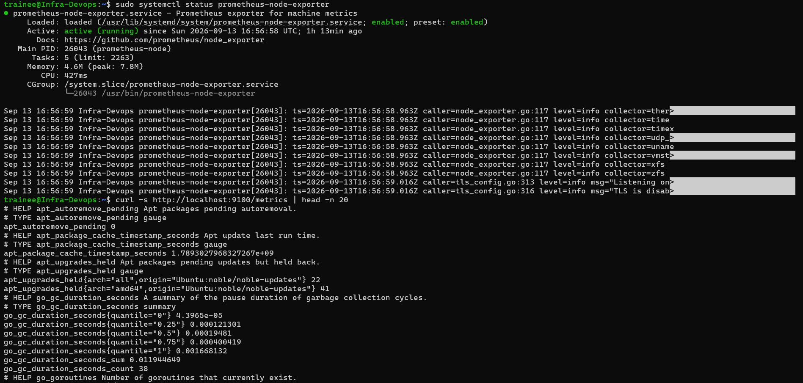

# infra-devops-assignment
Assignment for Techkraft

## Setup Instructions

### 1. Setup Ubuntu Environment

<figure>
  
  <figcaption>Figure 1: Ubuntu Setup in Oracle VirtualBox.</figcaption>
</figure>

<br>

### 2. Create trainee User

<figure>
  
  <figcaption>Figure 2: Add trainee User with sudo Privilege.</figcaption>
</figure>

<br>
<br>

* Add trainee user skipping the comments and add to sudo group
```bash
adduser --comment "" trainee
usermod -aG sudo trainee
su - trainee
```

### 3. Setup and Harden Key Based SSH Authentication

<figure>
  
  <figcaption>Figure 3: Generate the Key.</figcaption>
</figure>

<br>
<br>

```bash
ssh-keygen -t ed25519
```

<br>

<figure>
  
  <figcaption>Figure 4: Setup the Key.</figcaption>
</figure>

<br>
<br>

* Setup the key based ssh authentication in remote server
```bash
mkdir .ssh
chmod 700 .ssh
cd .ssh
vi authorized_keys
chmod 600 authorized_keys
```

<br>

<figure>
  
  <figcaption>Figure 5: Harden SSH Daemon.</figcaption>
</figure>

<br>
<br>

* Restart the ssh server
```bash
sudo systemctl restart ssh
```

<br>

<figure>
  
  <figcaption>Figure 6: Portforward in VirtualBox.</figcaption>
</figure>

<br>
<br>

<figure>
  
  <figcaption>Figure 7: Key Based Authentication with Hardened SSHD.</figcaption>
</figure>

<br>

### 4. Enable and Configure UFW

<figure>
  
  <figcaption>Figure 8: UFW Configuration.</figcaption>
</figure>

<br>
<br>

* UFW configuration for ssh, http and https
```bash
sudo ufw default deny incoming
sudo ufw default allow outgoing
sudo ufw allow 2222/tcp comment 'Hardened SSH'
sudo ufw allow 80/tcp comment 'HTTP'
sudo ufw allow 443/tcp comment 'HTTPS'
sudo ufw --force enable
```

### 5. Docker Setup

<figure>
  
  <figcaption>Figure 9: Docker Installation.</figcaption>
</figure>

<br>
<br>

* Install docker and add it to sudo group
```bash
# Add Docker's official GPG key:
sudo apt update
sudo apt install ca-certificates curl
sudo install -m 0755 -d /etc/apt/keyrings
sudo curl -fsSL https://download.docker.com/linux/ubuntu/gpg -o /etc/apt/keyrings/docker.asc
sudo chmod a+r /etc/apt/keyrings/docker.asc

# Add the repository to Apt sources:
sudo tee /etc/apt/sources.list.d/docker.sources <<EOF
Types: deb
URIs: https://download.docker.com/linux/ubuntu
Suites: $(. /etc/os-release && echo "${UBUNTU_CODENAME:-$VERSION_CODENAME}")
Components: stable
Architectures: $(dpkg --print-architecture)
Signed-By: /etc/apt/keyrings/docker.asc
EOF

sudo apt update

sudo apt install docker-ce docker-ce-cli containerd.io docker-buildx-plugin docker-compose-plugin

sudo usermod -aG docker trainee
```
<br>
<br>

<figure>
  
  <figcaption>Figure 10: Docker Containers.</figcaption>
</figure>

<br>
<br>

* Run the containers with docker compose and list it
```bash
docker compose up -d
docker ps
```
<br>
<br>

<figure>
  
  <figcaption>Figure 11: Port Forward in Virtual Box for Accessing the app from the Browser.</figcaption>
</figure>

<br>
<br>

<figure>
  
  <figcaption>Figure 12: App access from the Browser.</figcaption>
</figure>

<br>

### 6. Health Check Script

<figure>
  
  <figcaption>Figure 13: Setup Script and Add it to Cron.</figcaption>
</figure>

<br>
<br>

* Copy the script and setup cron
```bash
sudo mkdir -p /opt/scripts
sudo mv infra_health_check.sh /opt/scripts/
sudo chmod 750 /opt/scripts/infra_health_check.sh
sudo touch /var/log/infra_health.log
sudo chmod 666 /var/log/infra_health.log
crontab -e
```

<br>
<br>

<figure>
  
  <figcaption>Figure 14: Health Check Log Output from Cron.</figcaption>
</figure>

<br>

### 6. DB Backup

<figure>
  
  <figcaption>Figure 15: DB Backup Successful.</figcaption>
</figure>

<br>
<br>

* Copy the script and setup cron
```bash
sudo mv db_backup.sh /opt/scripts/
sudo chmod 750 /opt/scripts/ db_backup.sh
```
<br>
<br>

<figure>
  
  <figcaption>Figure 16: DB Restore Successful.</figcaption>
</figure>

<br>
<br>

```bash
sudo gunzip -c /var/backups/db/db_backup_YYYYMMDD.sql.gz | docker exec -i db_postgres psql -U appuser -d appdb
```

### 7. Metrics/Monitoring

<figure>
  
  <figcaption>Figure 17: Prometheus Installation and Metrics Output.</figcaption>
</figure>

<br>
<br>

* Install prometheus-node-exporter and output the metrics collected
```bash
sudo apt install -y prometheus-node-exporter
sudo systemctl enable --now prometheus-node-exporter

curl -s http://localhost:9100/metrics | head -n 20
```
